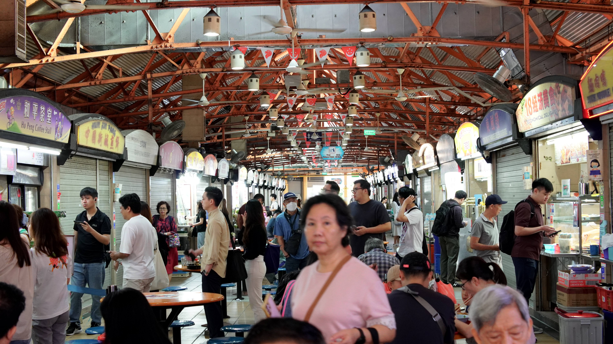
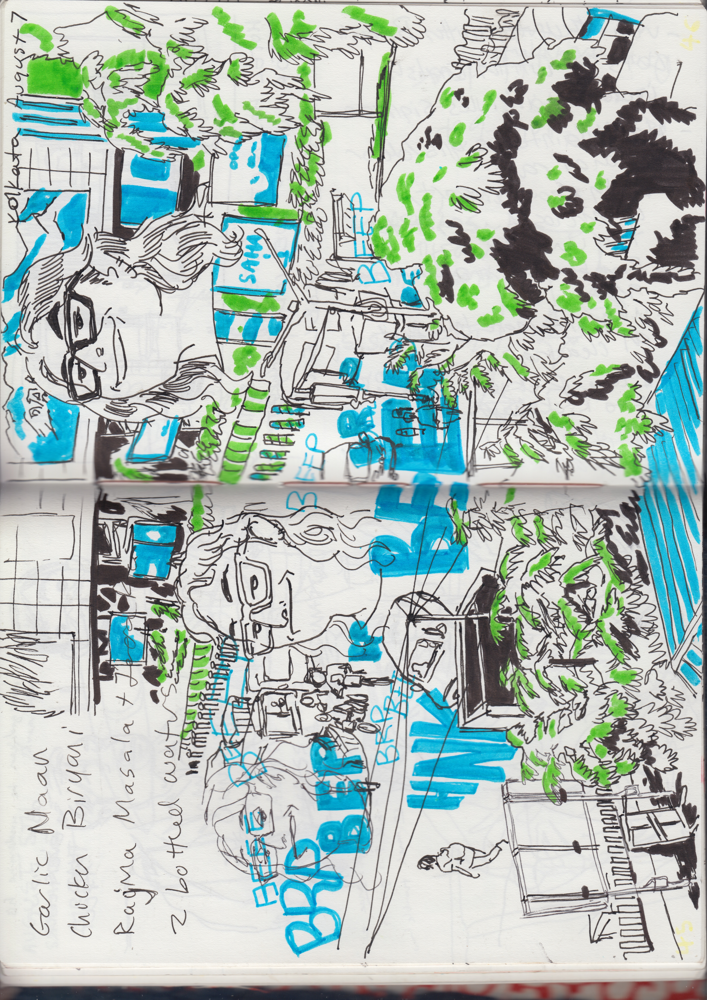
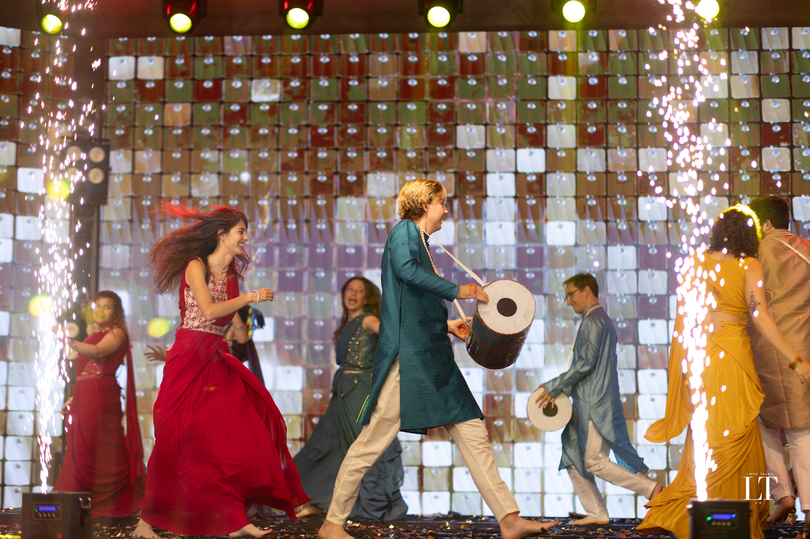
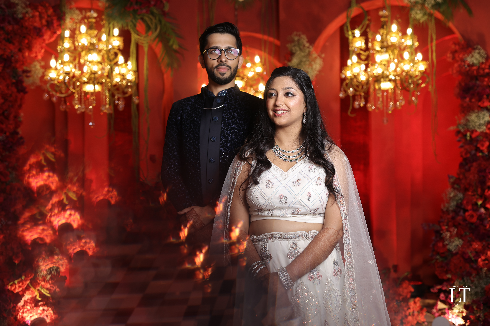
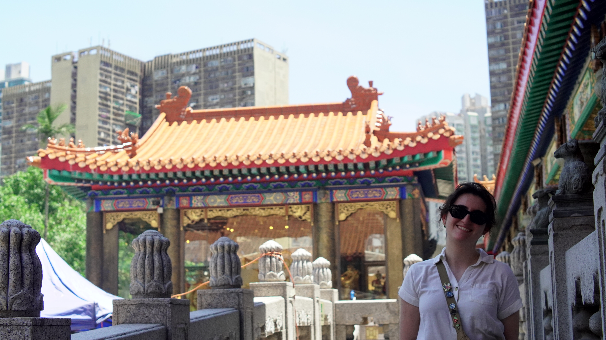

I'm back from abroad! The trip was largely a success, food poisoning aside. Michelle and I travel well together, and there's not a lot of people in my life I could spend 15 days hip to hip with and not be sick of. Also we had our two year anniversary on this trip! It doesn't really come up in this reflection because I had other things that I wanted to write about but! That's crazy! All to say this is not a remotely comprehensive summary but I tried to articulate my biggest thoughts about my experience as best I could:  

## Singapore  
 
Because of a carefully orchestrated 13-hour layover, we got to have a day trip to Singapore. We spent some time in the airport, which is by all accounts the world's best airport, and ventured into the city, which is by non-Catholic accounts the world's best citystate.  

Singapore is an incredibly young country. On our cab ride from the airport to a hawker center (a category of dining hall where you can get excellent street food for cheap prices), we heard ads on the radio talking about a concert celebrating the country's upcoming 60th anniversary. In that context, the place is a miracle. It has the best passport in the world (visa-free or on-arrival access to 193 countries). It's ranked highly in most quality of life indicators, including home ownership (88%), healthcare, and education. Singapore has thrived because of careful maneuvering by some of the savviest political leaders the world has ever seen. Because the country is so small, its reputation is incredibly important (hence the killer airport), but so is the cooperation of its people. 

Singapore is ranked poorly in one global metric: press freedom, where it is 123rd in the world. Sometimes described as a semi-authoritarian state, Singapore is governed by a single (very effective) political party that has strict (if easy) ideas about what constitutes acceptable behavior.  All that sounds intense, but it doesn't feel intense. 

We didn't see anyone act scared during our trip. From what I saw, following every rule appears to be important, and even small rules are enforced (the government fined 38,000 people around 1,500 USD equivalent for littering last year, for instance) but it's not like the rules are hard to follow. The place is an urban designer's wet dream. Beautiful clear signage everywhere combined with structures that are clearly designed to get people to act the right way at the right time all the time. Every time we did something wrong (put something in the wrong trash can, for instance), a local gently helped us out.
  
Everyone we interacted with was lovely (English is an official language, and seems to be the dominant one), but I can't imagine spending more than two days there without getting bored. There just wasn't a lot to do, and while I wish we had spent more time in the city than the airport, I don't feel a deep need to go back. I will however, continue to be fascinated by Lee Kuan Yew (aka LKY), the first prime minister (and low-key benevolent dictator) of Singapore. Before he passed in 2015, he wrote a few books, but I want to find information about him that isn't filtered though his or the state's lens. Nevertheless, I've been successfully propagandized into thinking this guy was one of the only philosopher kings this world has ever seen. Look at what they've gotten done in 60 years!
 
## Kolkata, India  
  
I don't want it to seem like this is a description of a trip to India. It wasn't even really a trip to Kolkata. It was a trip to an airport, a Holiday Inn, a Westin Hotel, some lakefront cottages, and the roads in-between those locations. Nothing more or less. The wedding was an immersive cultural experience where I got to do and see things I'd never heard of with hundreds of people I will never meet again. It was also a little too loud, a little too hot, and I got food poisoning. Here is a small selection of what I experienced:

We got in close to midnight local time, and took a pre-paid driver to a Hampton Inn near the airport. The first moments in India were terrible- an immigration officer condescended to Michelle and then was nice (enough) to me. Our driver was impossible to find because he didn't think to _hold up the sign with my name on it_. Then, once we found him, he sped us to the hotel without any real conception of petty concepts like “lanes” “right of way” or “defensive driving”. All the while he honked at everything that moved. So we didn't tip.

Turns out, that's just what driving is like in India. But we didn't see any accidents! So maybe the system works. The next day we just lazed about in the hotel all day, which rocked. I found a new favorite breakfast food (Aloo Paratha), we got room service for like 12 bucks American, and read books in bed. We also found out that Kolkata has fruit bats the size of birds! Which Michelle ended up watching through our hotel window in a stance reminiscent of an immigrant uncle watching a football game- hands behind back, slightly hunched, totally still except for slight head motion to follow the action.  

During the wedding itself, we stayed at these picturesque lakeside cottages in the middle of a city park. For some reason the park also had a 1/3rd scale Eiffel Tower. The humidity was intense enough that I was able to steam the wrinkles out of my clothes by spending 20 minutes on the back porch as I drank my morning tea.  

 
The groom's family is from the area and they made up the bulk of the wedding's attendees. They are moneyed- I heard that the wedding cost something like a quarter of a million dollars USD. This thing was a very specific kind of extravagent. Every event got its own unique set dressing. For a ceremony where the families give gifts to each other, they covered two walls of a hotel ballroom in vines and flowers, brought out potted plants and platforms and lights, drum and horn players, robed monks, and set up a themed open bar. All for a two hour ceremony (of which there were six or so).  

That said, the amount of decoration felt expensive in its quantity, but not its quality. Plastic opulence.  

 
I don't want any of this to come across as ungrateful, or criticism of the couple at the center of it all. Vindy is Michelle's best friend, and she is this big smart funny personality. The way I saw her friends love her reminds me of the way my mom was loved by her friends. The kind of person who doesn't attract everyone, but the people she attracts would take a bullet for her. V, her now-husband, is the kind of person you wish you could hate. Handsome, an incredible dancer, smart, grounded, effortlessly charismatic, a data scientist with a master's degree from Columbia. Vindy bagged a 10. Because of the traditions at play, I didn't get to see them interact a lot but when I did I could feel their connection from across the room. These people are obviously home to each other.

On the day of the wedding, I woke up feeling queasy but we pressed on to the Westin. the bride and groom entered the hotel through a cloud of candy-colored smoke while we used streamers to form an arch above their heads. In a large ballroom, the wedding played party games in two teams: the bride led the groom's side and the groom led the bride's side. A little bit into the games, I ran to the toiler and started puking, so I missed most of the games.  
After, I followed Vindy around, helping where I could but mostly trying to stay still. Slowly, the bride's wedding party convened, now fully decorated in saris and turbans, and the still-useful members of our crew did what they could to squirrel her some real food and give her some company as paaid attendants assembled her into a bride. 
 
Next, there was an hour-long procession where Vindy and Vee were brought into the wedding banquet hall on carriages (Vindy's was a traditional horse-drawn, Vee's was a fancy classic car). They fired firework guns into the air and all of their friends danced around them. Or so I was told, at this point I was sitting inside the wedding venue trying to mind-over-matter my way into feeling normal. Once they got inside, we made the call that I was not going to be able to hold on till the wedding proper. So one of Vindy's friends called me an Uber and I went back to the cottages.  

As I left, I saw Vindy, seated in a giant ornate chair, get hoisted by her friends and professional wedding workers and carried to the platform where the actual ceremony was going to happen. I'm told there was a lot of drumming and chanting, and sitting still while people around them ate. At 12:40am (a time decided by an astrologer), the wedding itself began. I'm told that family members dumped uncooked rice on their heads. That there was a secret mission to get Vindy some painkillers. That the ritual was a test of endurance where almost everyone left, but all of Vindy's friends (who were not bedridden, defeated by bacteria) stayed until the very end.  

The ceremony ended at 5:40am. Michelle returned to our cottage, where I was asleep. We left for the airport. I ate what I could. I felt so gross that I bought a complete outfit in the Dehli airport during a layover. Then we walked onto an airplane. When we walked off we were in...  

 
## Hong Kong  
When we were at this souvenir shop, we saw a patch that said something like “Quick but not hurried.” That's how Hong Kong feels. You get out of your hotel and onto the subway and get off and walk a few blocks now you're at your destination as easily as a leaf travels down a fast moving stream. _Technically_ the traveling took 25 minutes but you don't feel like you're “waiting” the way you do in a car because the steady movement and regular changes of scenery decorates the time.

Before I go on, here's a brief list of what we literally did: I got us lost in a mall three different times, we went to a Buddshit nunnery and a monastery, I got very scared on a Gondola, we took a ferry to an island where a bunch of expats live, I bought (mostly mediocre) used books at a packed mall for collectors, we tried egg tarts for the first time, we got drunk off soju, we bought six dollar take-away sushi, we saw a Chinese opera performance, we went to go see some monkeys, we went to a museum, I bought an expensive clock, and more! We also walked, a lot.  

So much of the experience of any city is passive. I think a main reason why so many people dislike Los Angeles is because the city, as you see it in your peripheral vision as you drive, is ugly. Measured by that same instrument, Hong Kong is interesting and exciting. There's graffiti that's still getting away with it. Wheatpasted posters and bamboo scaffolding. There's an apartment-building sized PSA from the government reminding people to fix their AC units so the water doesn't drip on everyone's heads. I don't think that the city feels like a big cooperative tightly-controlled project the way that Singapore does. Instead it feels like a ten year old laptop that's covered in five layers of stickers. There's two centuries of loud individuality layered over each other! Of course it's fun to look at.
  
I'€™ll also say the city does not suck its own dick enough. The only times we saw proper tourist “Hong Kong pride” type stuff was at a tourist shop next to a famous bakery and (bizarrely) at a huge statue of the Buddha. It feels like the city's gaze isn't turned inward, but instead somewhere else. Often Japan. They seem to really like Japan.
  
I can't remember if Michelle said it first or the reverse, but by the end of our time in the city we agreed that Hong Kong was one of the top ten cities in the world and at its peak was probably the best city in the world. It felt like New York mixed with Tokyo, despite being a Chinese former Crown colony. Michelle said she felt incredibly safe the entire time, even though we were shoulder to shoulder with millions of people. It didn't feel choked of expression (despite the Bejing-imposed National Security Law). It just felt incredibly human, I don't know how else to put it. Where American cities might have a dominant personality (if I say a Portland-type, or a Los Angeles-type or an Austin-type there's a person you probably picture), but I didn't sense that there was a Hong Kong-type. Some of that might be cultural ignorance (most of the language we heard was Mandarin or Cantonese, even though most people spoke some English). But it really did feel like 7.5 million grounded, normal people navigating some of the most specific circumstances in the world and doing a decent job of it.
  
Mid-way through our week in the city, I got coffee with the coordinator for the Art History MA at Hong Kong University. We had a lovely two hour conversation about the program, museums, and a few other things. I think I made a good impression. Maybe I'll get to go back as a student. I hope I get to learn more from, and about, such a unique place.
